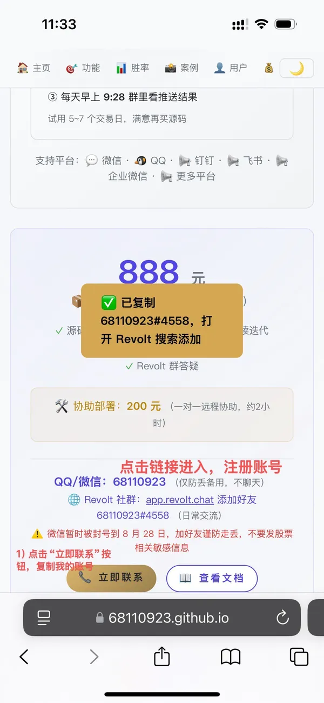
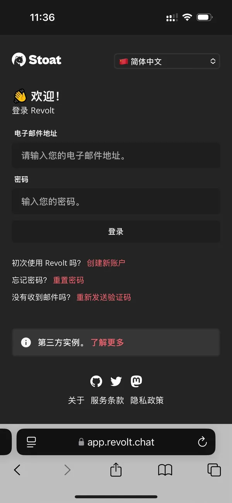
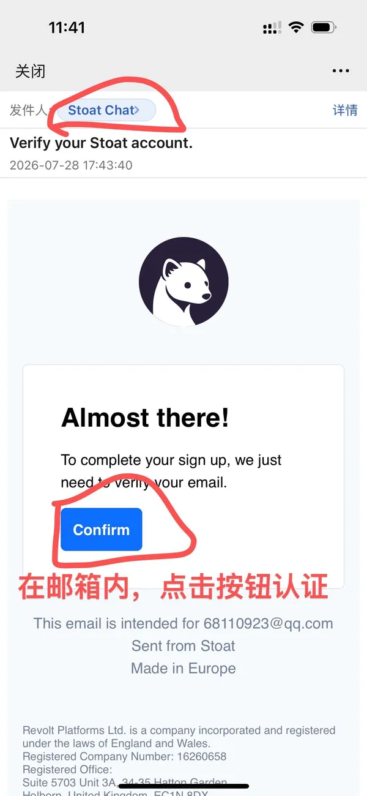
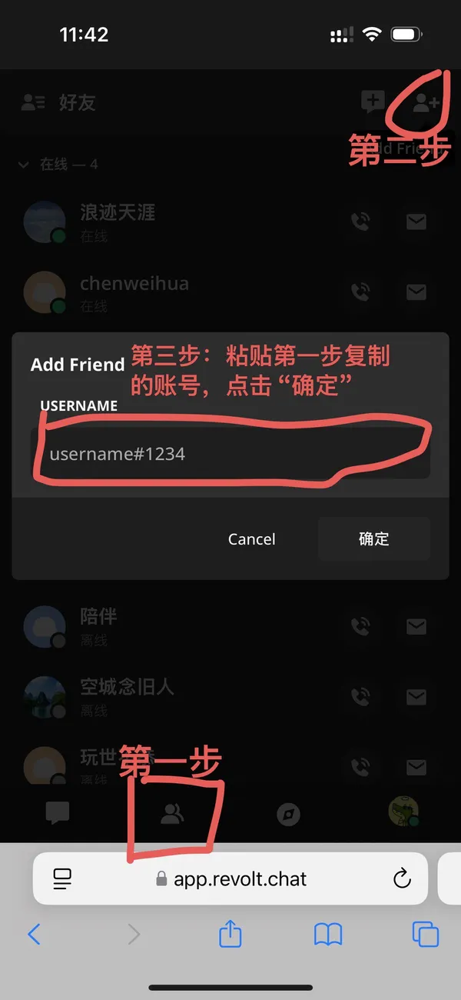
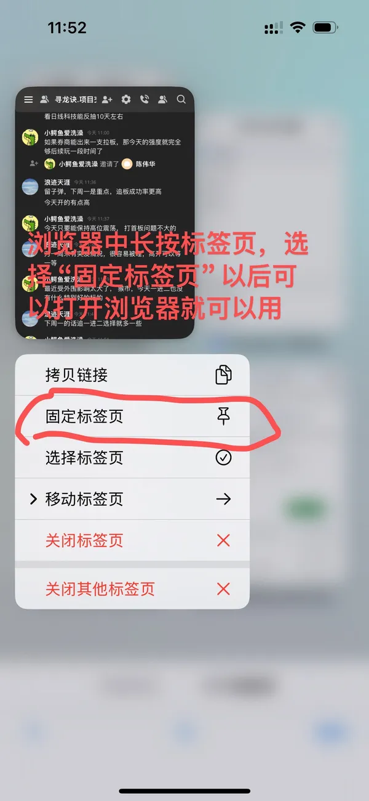

<p align="center">
  
  
  
</p>

<h1 align="center">🐉 寻龙诀</h1>
<h3 align="center">官方网站：<a href="https://68110923.github.io/xunlongjue_doc/">大A主板 · 量化系统</a></h3>
<p align="center"><i>—— 不做预测，只抓确定性。首板三千，二板寻龙。</i></p>

---

## 📢 通知

### 🔥 8月实盘战绩 `-20261001`
每天全市场只推 ≤3 只，8 月拿得出手的启动点：
▸ 楚天龙：08/24 最高分 → 7个交易日涨 **+53%**
▸ 誉衡药业：08/10 推送 → 6个交易日涨 **+51%**
▸ 青山纸业：08/26 最高分 → 5个交易日涨 **+31%**
▸ 锦龙股份：08/27 最高分 → 4个交易日涨 **+26%**
想跟上这种启动点？**88 元试用** 5~7 个交易日，抓不到涨停自动延期。

---

## 👤 谁在用

| 🔰 **打板新手** | 📉 **亏多了的老手** | 💼 **上班族** |
|---|---|---|
| 不知道每天打哪只<br>系统帮你筛到 ≤3 只<br>不再大海捞针 | 追涨杀跌管不住手<br>让量化系统替你决策<br>纪律比直觉可靠 | 没时间盯盘研究<br>微信到点自动推送<br>看看消息就能决定 |

---

## 🎯 它能做什么

| 功能 | 介绍 |
|------|------|
| 🐉 一进二寻龙 | 全市场 3000+ 首板 → 16 闸过滤 → 10 维评分 → 双区择优 → ≤3 只推送。每天 9:25 自动推送到微信。 |
| 📐 个股/大盘预测 | MA5 + KDJ + MACD + MA10 四维共振打分。秒出信号：🔥强多/🔴偏多/⚪中性/🟢偏空/❄️强空 |
| 📋 每日复盘 | 收盘自动复盘：推了什么、中了多少、为什么漏了。15:01 自动推送，策略持续迭代。 |
| 🔍 深度分析 | 主力痕迹拆解：洗盘→试盘→吸筹→出货→拉升。60天全景K线 + AI 拆解。 |
| ⭐ 选好票 | 全市场 3000+ 股票秒级扫描，MA5+KDJ+MACD+MA10 四维打分，一键筛出 ≥10 分强多票。 |
| 🌅 明日观察 | 盘后预测次日连板概率，全市场涨停+板块+封单+竞价多维筛选，附具体买入条件。**定制化超强**：直接和 AI 沟通即可快速修改优化策略，支持加入消息面因素，输出可直接用于复盘文章创作。 |

---

## 📊 月度一进二成功率

| 月份 | 胜率 |
|------|:----:|
| 2025年01月 | 52% |
| 2025年02月 | 48% |
| 2025年03月 | 55% |
| 2025年04月 | 59% |
| 2025年05月 | 54% |
| 2025年06月 | 63% |
| 2025年07月 | 60% |
| 2025年08月 | 68% |
| 2025年09月 | 65% |
| 2025年10月 | 71% |
| 2025年11月 | 74% |
| 2025年12月 | 69% |
| 2026年01月 | 64% |
| 2026年02月 | 70% |
| 2026年03月 | 76% |
| 2026年04月 | **78%** |

> 近5个月全量回测有效胜率 **71%** · 8400+ 首板样本 · 累计推送 650+ 次

---

### 💰 定价

| 项目 | 价格 | 说明 |
|------|------|------|
| 📦 **源码** | **888 元** | 交付源码 + 部署教程，策略持续迭代 |
| 🛠️ **协助部署** | **200 元** | 一对一远程协助部署（约2小时） |

> 不用担心不会搞——买了源码不会用？我教到你会为止。

> 💡 想先试试？**88 元** 试用 5~7 个交易日，满意再买，**试用期内购买可全额抵扣**。

<p align="center">
  <b>QQ / 微信：68110923</b><br>
  <span style="color: #e53935; font-weight: 700;">仅防丢备用，不聊天</span><br>
  <span style="color: var(--accent);">🌐 Revolt 社群：<a href="https://app.revolt.chat/" target="_blank" style="color:var(--accent)">app.revolt.chat</a> 添加好友 68110923#4558</span><br>
  <span style="color: #999;">日常交流、试用、正式群都在这里</span><br>
  <span style="color: #e53935; font-size: 12px;">⚠️ 微信仅添加付费用户，未付费请勿添加，防止添加好友频繁</span><br>
  <span style="color: #e53935; font-size: 12px;">⚠️ 微信/QQ 有关股票、交易、拉群等敏感信息一律不回复，防止被封号</span>
</p>

> 💻 自行部署请查看 [部署文档](https://github.com/68110923/xunlongjue/blob/main/DEPLOY.md#%E5%AF%BB%E9%BE%99%E8%AF%80--%E9%83%A8%E7%BD%B2%E6%96%87%E6%A1%A3)

---

### ❤️ 购买源码

扫码付款时，备注你的微信/QQ 即可，收到后加我 Revolt，我拉你进群、发部署教程：

<div align="center">
  <table>
  <tr>
    <td align="center" width="33%">
      <b>支付宝支付</b><br>
      
    </td>
    <td align="center" width="33%">
      <b>微信支付</b><br>
      
    </td>
    <td align="center" width="33%">
      <b>公众号</b><br>
      
    </td>
  </tr>
  </table>
</div>

> 你的支持是我持续更新的动力！🎉

---

## 📱 不用装 APP，消息直接推到你微信

<p align="center">
  <b>不需要装 APP，不需要打开网页，系统直接把结果发到你微信。</b>
</p>

```
📦 购买源码 → 收到部署教程 → 拉你进 Revolt 群
├─ 自己部署 — 跟着教程走，免费
└─ 远程协助 — 我远程帮你搞定（约2小时）

✅ 部署完成 → 绑定你的微信 → 自动推送消息
✅ 随时可问你的机器人【预测】【深度分析】【选好票】，秒回分析
```

> 支持：💬 微信 · 🐧 QQ · 📢 钉钉 · 📢 飞书 · 📢 企业微信 · 📢 更多平台

---

## 🚀 快速了解寻龙诀

### 这是什么？

<details>
<summary><b>这是个软件吗？具体是什么？</b></summary>
<p>它是<strong>部署在你自己的电脑或服务器上的一整套 AI 量化系统</strong>，专门针对 A 股。每天自动选股、预测、复盘，到点把结果发到你微信上，你只需要看消息就够了。</p>
</details>

<details>
<summary><b>我完全不懂股票，能用吗？</b></summary>
<p>能。🔥强多=可以关注，🟢偏空=先等等。KDJ、MACD 这些你不用管，系统算好了，你只看颜色和文字就行。</p>
</details>

### 能做什么？

<details>
<summary><b>🔥 一进二寻龙（9:25 推送）</b></summary>
<p>每天 <strong>9:25</strong> 开盘前，系统扫描全市场 <strong>3000+ 首板</strong>，经过 14 道硬逻辑 + 10 维评分，把最可能连板的 ≤3 只推到你微信。不是海选，是精选——宁错过，不做错。</p>

**真实推送示例：**
```
⚡ 上证信号：+2 🔴偏多 → 可以搞
📊 统计：昨首板61 → 候选16 → 推送1
▸ 推送：滨化股份 +67分 Gap +3.27% 123亿 化学原料
🏆 最高分：百合花 39分 未推送
```
</details>

<details>
<summary><b>📐 个股 / 大盘预测（发代码秒回）</b></summary>
<p>想知道某只股票明天怎么走？微信发「600519」或「上证指数」，<strong>秒回方向 + 仓位建议</strong>，基于 MA5 / KDJ / MACD / MA10 四维打分。</p>

**真实预测示例：** 天娱数科（002354）· 06/09 预测
```
📊 近10天趋势：-12 -8 -2 +6 +8  跌停→三连板V型反转
📐 评分：MA5+3 KDJ+1 MACD+2 MA10+2
⚡ 信号：🔥强多 · 干就完了
🔍 解读：盘面一句 + 锚点一句  给具体价位触发条件
```
</details>

<details>
<summary><b>📋 每日自动复盘（15:01 推送）</b></summary>
<p>收盘后自动推送复盘：<strong>推了什么、中了多少、为什么漏了</strong>——全透明。对在哪、错在哪、漏在哪，一清二楚。</p>

**真实复盘示例：** 06/09
```
📊 统计：昨首板29 → 候选5 → 推送0 → 涨停0
🔥 推送表现：今日无推送，宁错过不做错
🔍 策略诊断：候选5只零推送，过滤在线。6只盲区需关注覆盖面
📈 整体盘面：大盘+1.28%，涨停112家，计算机25只涨停领跑
💡 明日建议：关注元件/计算机方向，优先低位补涨，回避高位追涨
```
</details>

<details>
<summary><b>🕵️ 深度分析 · 主力痕迹</b></summary>
<p>预测看不清？拉 <strong>30 天全景 K 线</strong>，AI 解析价量序列，吸筹→洗盘→反转→主升，<strong>每一步都还原</strong>，主力意图无处可藏。</p>

**真实拆解示例：** 沃格光电（603773）· 58→150，涨幅 158%
```
🕵️ 主力痕迹：
0424-0430  底部吸筹  58-69区间横盘，MACD金叉
0514-0518  暴力洗盘  三个跌停88→67，地量封死
0519-0528  V型反转  7天67→110涨64%，四个涨停
0601-0609  主升第二波  114→150涨32%
💡 建议：守5日线持有，回踩140缩量可加仓
```
</details>

<details>
<summary><b>⭐ 全市场选好票（秒级扫描）</b></summary>
<p>大盘回暖想找方向？发个「选好票」，全市场 <strong>3000+ 股票秒级扫描</strong>，MA5+KDJ+MACD+MA10 四维打分，按板块分组，<strong>一键筛出强多票</strong>。</p>

**真实扫描示例：** 3196只主板 · 39秒 · 四维打分 · 按板块分组
```
模型：MA5 + KDJ + MACD + MA10
门槛：≥10 分强多票

06/09 输出 → 化学原料2只 · 新闻出版2只 · 橡胶2只 · 其他7只
              双欣材料+12、圣晖集成+12 领跑
```
</details>

<details>
<summary><b>🌅 明日观察（预测次日连板概率）</b></summary>
<p>盘后 AI 深度分析次日连板概率——从全市场涨停池精选（一进二、二进三及更高连板都覆盖），结合<strong>封单、竞价、换手、板块梯队</strong>综合判断，附具体买入条件，还能直接当复盘文章素材。</p>
</details>

<details>
<summary><b>🛠️ 策略随你改 · AI 随你问</b></summary>
<p>系统不是死的——<strong>直接和 AI 说你的想法</strong>就能调整优化策略，支持加入消息面因素；有任何股票问题都可以直接问它，<strong>随时秒回</strong>。</p>
</details>

### 怎么加入？

<details>
<summary><b>Revolt 是什么？怎么注册？</b></summary>
<p>Revolt 是一个开源的网页聊天软件，类似 Discord。不用下载安装，打开 <a href="https://app.revolt.chat/" target="_blank">app.revolt.chat</a> 注册账号就能用。试用群、正式群、日常交流都在这里。注册流程看下面这 5 张图：</p>
<p>
  
  
  
  
  
</p>
</details>

<details>
<summary><b>怎么试用？试用多久？有什么限制？</b></summary>
<p>试用期为 <strong>5~7 个交易日</strong>，每个用户限试用一次。<strong>试用期内推送命中不足 2 只涨停，试用期自动延长，抓到为止。</strong>试用期间每天在群里看推送结果，<strong>不包含源码</strong>。满意再买源码，<strong>试用期内购买可全额抵扣 88 元</strong>（888 → 800），试用期结束则不再抵扣。</p>
</details>

<details>
<summary><b>怎么购买？付款后怎么用？</b></summary>
<p>直接扫码付款就行，支付宝扫上面的码。付完后备注你的微信或 QQ 号，我看到会第一时间联系你，把源码发给你。收到源码后，部署到你自己的电脑或云服务器上（不会搞可以花 200 元让我远程帮你搞定），绑定好微信，系统就会自动运行。<strong>888 块永久使用</strong>——市场会变，策略也会跟着优化，你买的不是一套死代码，而是一个持续进化的系统。</p>
</details>

<details>
<summary><b>不会部署怎么办？没电脑能行吗？</b></summary>
<p>三条路任选：</p>
<p>① <strong>自己部署</strong> —— 部署到你自己的电脑或云服务器（推荐，24小时在线），照着教程走，免费</p>
<p>② <strong>远程协助</strong> —— 花 200 元我远程帮你搞定（约 2 小时）</p>
<p>③ <strong>不部署只看结果</strong> —— 我拉你进 Revolt 群，群里已有几位用户和你一样没部署，每天早上 <strong>9:28</strong> 左右我把推送结果截图发到群里，你直接看就行</p>
<p>买云服务器的话，以下两款比自己电脑一年电费还便宜：</p>
<p>☁️ <strong>腾讯云</strong> — <b>99 元/年</b>，买一年送三个月，相当于 <b>99 元 15 个月</b>：<a href="https://curl.qcloud.com/ucrFUOFD" target="_blank">https://curl.qcloud.com/ucrFUOFD</a></p>
<p>☁️ <strong>阿里云</strong> — <b>38 元/年</b>（需抢购），<b>99 元/年</b>（不用抢）：<a href="https://www.aliyun.com/minisite/goods?userCode=scuhon0q" target="_blank">https://www.aliyun.com/minisite/goods?userCode=scuhon0q</a></p>
<p>数据安全放心：所有数据只存在<strong>你自己的电脑或服务器</strong>上，不经过任何第三方。</p>
</details>

### 💡 使用技巧

<details>
<summary><b>大模型怎么选？</b></summary>
<p>系统跑起来的 AI 大脑（大模型 API）怎么选？推荐按这个顺序：</p>
<p>🥇 <strong>首选 智谱 GLM-5.3-Flash</strong> —— 性价比最高，日常预测、复盘完全够用，新用户注册有免费额度。注册入口：<a href="https://www.bigmodel.cn/invite?icode=K8NECDSgXrJnUVrpbVug2%2Bnfet45IvM%2BqDogImfeLyI%3D" target="_blank">bigmodel.cn</a></p>
<p>🥈 <strong>备选 DeepSeek deepseek-v4-flash-vision-exp</strong> —— 需要图片分析等视觉能力时选它。注册入口：<a href="https://platform.deepseek.com/usage" target="_blank">platform.deepseek.com</a></p>
<p>两个都免费注册，部署时按教程把 Key 填进去就能跑。</p>
</details>

---

<p align="center">
  <sub>⚠️ 行情数据来源：同花顺 / 新浪 / baostock | 仅供研究学习，不构成投资建议 | 市场有风险，投资需谨慎</sub>
</p>

---

## 📝 更新日志 

### V20260904 (2026-09-04)
- 🔧 **预测趋势天数可调** — `market_signal.py` 新增 `--days N` 参数，趋势回看天数自由设定（默认10天不变），可与代码/日期参数任意组合，长周期盘面结构一屏看清；输出数据同步携带实际天数。

### V20260901 (2026-09-01)
- 🔧 **回测汇总增强** — `--max` 模式下底部汇总统计纳入候选池最高分行，推送与漏选表现一键对比；默认模式口径不变，命中统计始终按推送行计算。
- 📋 **复盘输出对齐模板** — 收盘复盘推送严格按输出模板：盘面段禁止出现具体连板数（改高标存活/断板等定性描述）、梯队数据只消化不输出、推送列表强制代码块包裹。
- 🤖 **明日观察子代理执行** — 「明日观察」由无上下文子代理独立跑完五阶段工作流，主代理只做格式校验，保证每次选股深度与覆盖面一致，不受主上下文影响。

### V20260826 (2026-08-26)
- 📏 **振幅闸放宽** — 首板振幅上限上调，减少大波动换手板的边界误杀，覆盖更多真实换手板。
- 🧱 **回撤硬闸阈值放宽** — 高位反弹识别的回撤容忍度上调，深回撤区间的高活跃首板不再一刀切，低位启动豁免规则不变，历史与实盘口径保持统一。
- 🔧 **回测 CLI 简化** — 移除模式参数，直接 `python3 backtest.py [天数|起始日期|日期范围] [--max]`，`--max` 可选输出候选池最高分行（默认仅推送行）。

### V20260825 (2026-08-25)
- 📊 **深度分析窗口扩大** — 主力痕迹回看区间从近30天扩至近60天，趋势结构与位置判断覆盖更长运行波段，起涨前形态看得更完整、更客观。
- 🔧 **实时行情字段解析修复** — 修复盘中行情换手率字段错位问题（原误读盘口挂单量），字段按官方口径重新对齐，行情数据更准确可靠。

### V20260821 (2026-08-21)
- 🚫 **断板反包高标拦截** — 近期多次涨停反复的首板（断板后反包型高标）直接排除，一进二只留低位启动首板，杜绝高位接刀。

### V20260818 (2026-08-18)
- 📡 **速览推送通道自适应** — 早盘竞价速览不再绑定特定账号，自动发送到部署者绑定的主通道（企微/微信/Telegram 等），支持环境变量显式指定目标，部署即适配。
- 🧱 **回撤回看窗口再拉长** — 高位反弹识别的历史波动覆盖范围进一步扩大，识别更全面，历史与实盘口径保持统一。
- 📋 **模板读取规则明确** — cron 定时任务输出格式已内联进任务本身，运行时不再读取模板文件；手动触发分析（预测/深度分析/选好票/回测/明日观察）则必须加载模板，两场景规则严格区分，输出稳定性双保障。
- 🚀 **部署文档内联模板** — 部署时创建定时任务的命令自带完整输出格式模板，部署即得完整推送效果，无需额外配置。

### V20260817 (2026-08-17)
- 🧱 **趋势位置评估升级** — 回撤与位置判断的回看窗口拉长，覆盖更长的历史波动区间，高位反抽识别更全面、更客观，历史与实盘口径保持统一。
- 🎯 **明日观察一进二模式** — 指定「一进二」时聚焦今日首板候选，长时间断板后重新启动的强势票视同首板对待；高连板梯队仍作为情绪参考辅助判断，推荐名单宁缺毋滥。
- ✍️ **推荐理由个性化** — 每只标的按真实K线形态独立描述，杜绝模板化套词，推荐更有针对性。

### V20260813 (2026-08-13)
- 🧱 **趋势位置硬闸上线** — 一进二候选新增回撤+位置组合过滤，自动识别"前期暴涨后崩盘反弹"的高位反抽票并剔除，减少追高套牢风险。
- 🟢 **低位启动豁免** — 尚处底部区域的深蹲起跳首板不受过滤影响，精准区分"反弹"与"启动"，不误杀真启动票。
- 📐 **复权链精确口径** — 基于日内涨跌幅递推复权链计算回撤与位置，自动消化除权影响，历史与实盘口径统一。

### V20260812 (2026-08-12)
- ⚡ **早盘推送速览快报** — 竞价数据算完立即先发精简速览（重点标的、评分、竞价涨幅、市值），完整解读随后送达，关键信息无需等待。
- 📭 **无推荐即时反馈** — 没有合适标的时，速览直接提示「今日无推送」，宁缺毋滥，结果即时可见。

### V20260811 (2026-08-11)
- 🎯 **明日观察精简输出** — 推荐聚焦核心标的，取消备用列表，宁缺毋滥只做最强。
- 📊 **全市场口径统计** — 板块与情绪分析覆盖全部市场（含创业板/科创板），主线判断更全面，候选仍聚焦主板。
- 🔍 **分析深度强化** — 强制逐只完整序列分析（量比/成交额/涨停历史/趋势形态），杜绝批量摘要偷懒，输出前逐票自检，确保每只都有形态+位置+量价判断。
- 🐉 **龙头思维情绪锚** — 推荐逻辑引入龙头思维：以板块核心龙头的表现作为情绪锚点，强龙头是正反馈、分歧炸板龙头是负反馈、断板前龙头同样可作情绪观察，好坏都是参考；身位不够的跟风票不作为情绪参考，板块无核心票则候选降级。
- ⚠️ **资源消耗提示** — 明日观察属深度分析功能，单轮约消耗 50 次左右的大模型调用，涨跌停数量多时可能需要更多，请留意 API 用量。

### V20260806 (2026-08-06)
- 🌅 **明日观察定制化升级** — 选股思路可随时与 AI 沟通调整，简单快速，支持加入消息面因素，策略完全随你定制。
- 🎨 **明日观察输出风格优化** — 推荐理由更贴近人话，每只票突出最关键看点，不再堆砌枯燥指标，主次分明重点突出。
- 🔍 **分析深度增强** — 深入判断趋势形态、当前位置与量价配合，连板结构识别更准确（纯首板/断板反包区分标注），选股判断更可靠。

### V20260805 (2026-08-05)
- 🌅 **明日观察全面升级** — 候选池从首板扩展至全市场涨停池，涵盖一进二、二进三及更高连板候选，不再局限于首板。
- 📊 **分析维度大幅增强** — 新增封单强度、竞价抢筹、换手率、炸板严重度四个判断维度，初筛标注系统（一字板/换手板/分歧板/全天烂板），排序更精准。
- 🤖 **完整执行流程落地** — 五阶段标准化工作流（看天→看地→挑人→排序→输出），「明日观察」触发词自动加载，输出 1-5 只宁缺毋滥。

### V20260803 (2026-08-03)
- 🌅 **明日观察功能上线** — 盘后手动精选次日一进二重点标的，结合首板+板块热度+趋势结构三维筛选，附具体买入条件，数量由你定。
- ⚡ **推送链路提速** — 优化定时任务执行流程，减少冗余环节，推送耗时显著下降。
- 🔧 **系统稳定性优化** — 辅助功能配置统一，运行更稳定。

### V20260801 (2026-08-01)
- 📋 **明日观察数量规则** — 输出数量由用户指定，只输出指定数量的重点标的，操作思路聚焦核心标的。

### V20260731 (2026-07-31)
- ⏰ **早盘推送时间提前** — 推送从 9:26 提前至 9:25，避开定时轮询相位延迟，确保 9:26 前准时开跑。
- 📱 **进群流程图上线** — 五步进群流程截图放入 README 与网页 FAQ 的试用群问答中，点开即看，不占版面。

### V20260730 (2026-07-30)
- 🎯 **涨跌停改用交易所公式** — 不再依赖 is_limit_up / pct 硬阈值，直接用收盘价与涨跌停价比较判定，自动适配各板块幅度（主板±10%、创业板/科创板±20%），并排除 ST。消除阈值误判和漏判。
- 🧹 **退市股自动清理** — 每周刷新新增清理步骤，数据源不再返回的股票自动标记退市，防止僵尸数据堆积。含 API 异常安全阀，避免误伤全库。
- 📄 **腾讯云优惠更新** — 网页端更新服务器优惠信息。

### V20260729 (2026-07-29)
- 🔇 **盘中/周刷新静默运行** — 定时数据拉取改为本地存储不推送，零 token 消耗
- 🐛 **MACD 数据泄漏修复** — 回测指标计算增加日期过滤，防止未来数据污染评分
- 📄 **部署文档优化** — 路径统一到 skill 分类目录，cron 命令参数格式修正，workdir 消除硬编码
- 🐛 **通知解析修复** — 补充日期范围格式，通知解析器恢复正常

### V20260713 (2026-07-13)
- 📊 **MACD 动量评分** — 一进二评分新增 MACD 维度，含 DIF/DEA 位置判定与趋势跟随，任意两项偏空叠加惩罚，提升弱势股识别能力。
- 🎯 **BOLL 极端超涨移除** — 删除宽度一刀切扣分，开口扩大已在强动量/死区等场景中纳入交叉判定，避免误伤真突破票。
- 📈 **大盘系数极值拉大** — 基底从 1.08~0.92 扩至 1.10~0.90，强化多空信号区分度，回测收益改善。
- 📄 **策略文档同步** — strategy.md 新增策略20、更新策略17b/19。

### V20260629 (2026-06-29)
- 📊 **大盘系数动态化** — 从固定6档改为基底+均线动态调节两层结构。基底系数向中性收敛，压缩极端行情放大效应。
- 📈 **融入大盘MA5/MA10位置关系** — 根据首板日上证收盘价与均线位置（站上/跌破）及穿越状态（上穿/下穿）对大盘系数进行双向微调，区分大盘均线支撑强度。
- 🧹 **系数计算抽成公共函数** — `get_market_coeff()` 纳入 `hermes_stock_lib`，早盘推送与回测同源调用，消除重复代码。
- 📄 **策略文档同步** — strategy.md 更新策略17b，从固定系数切换为双层动态系数设计。

### V20260626 (2026-06-26)
- 📊 **Gap低开水下惩罚加重** — 真低开（水下开盘）扣分幅度加大，降低弱势竞价票误推。
- 📈 **Gap二区上限大幅上移** — 中高开区间加分空间打开，符合竞价强度的票不再被压分。
- 📉 **Gap一区峰值压缩** — 最优区间加分上限下调，防止过度高估单一维度。
- 🔧 **Gap高开陷阱门槛收紧** — 高开陷阱触发点微调，减少打擦边球的票逃逸。
- 🔗 **Gap三段无缝衔接** — 低开→平开→高开三区间边界完全对齐，消除跳变断层。

### V20260625 (2026-06-25)
- 📈 **股价上限放宽** — 硬闸股价上限跟随牛市水位上调，减少高价优质标的误杀。
- 📉 **BOLL极端超涨扣分** — 带宽过大时加扣分，惩罚累计涨幅过高的均值回归风险。
- 📏 **市值区间扩大** — 上下限双向放宽，适应牛市市值膨胀，纳入更多中大市值标的。
- 🔄 **量比闸改为复合闸** — 缩量板不再一刀切，有换手的缩量真龙放行，无人关注票继续拦截。

### V20260624 (2026-06-24)
- 📊 **Gap评分六区间重做** — 通用线性插值函数驱动，低开~微高开递增加分、二区中档加分、一区高分微降、高开陷阱扣分、涨停价归零。淘汰旧毛刺评分。
- 📏 **二区下限下调** — 双区推送二区门槛微调，与评分区间对齐，减少边界误杀。
- 📈 **低开区间调优** — 平开/微高开区间加分斜率上调，降低低位票误伤。
- 📉 **大盘系数压缩** — 各档系数向1.00收敛，极端行情下影响大幅减弱，避免过度放大/缩小分数。
- 🐛 **大盘系数取昨收** — 修复早盘和回测都取当日盘中信号的问题，统一取首板日（昨日）收盘数据，消除手动重跑与cron结果不一致。
- 🔒 **历史日期竞价保护** — 修复跑历史日期时重拉API覆盖竞价快照的bug，与K线跳过逻辑对齐。
- 🐛 **封板时间评分修复** — 修复9:35-10:30段区间除数错误导致中段分数偏低的问题。
- 🐛 **竞价fallback修复** — 竞价缺失时改为取竞价日K线开盘价计算gap，不再误用首板日数据。
- 🏷️ **行业命名统一** — first_boards写入时取stocks_info行业，消除akshare/baostock两套命名导致的共振匹配失败。
- 🔗 **共振含双创真实涨停** — 板块共振统计纳入双创票，按实际涨停幅度判定，避免主板共振阈值虚低。
- 🚫 **首板池过滤双创** — first_boards只存主板票，防止双创混入推送候选。
- 📊 **量比硬闸上调** — 缩量板过滤门槛提高，减少出货板误推。
- 🎯 **推送门槛上调** — 最低推送分提高，进一步筛选优质标的。
- 💾 **竞价快照K线补全** — 用daily_kline数据补全近月竞价快照，消除缺失导致的评分偏差。
- 🧹 **废弃表清理** — 删除 `daily_review`(数据有误) + `strategy_optimizations`(已过时)，代码同步清理。
- 📄 **策略文档收敛** — SKILL.md 清除过时BOLL段，策略参数唯一真源指向 strategy.md。
- 🗑️ **删除一次性脚本** — 移除BOLL全量补算临时脚本，指标计算已集成在首次部署流程中。

### V20260623 (2026-06-23)
- 🎯 **双区推送策略重构** — 一区满额混合推送(一区优先+二区补充)，一区少量正常推，冰点二区≤2只。零冗余公共函数，早盘与回测同源调用。
- 📊 **BOLL评分体系重做** — 多档分级，%B×宽度交叉验证+中轨趋势调节。数据驱动设计，淘汰旧收口/开口逻辑。
- 📈 **回测新增7日最佳涨幅** — 推送股买入后7日内最高收益追踪，数据不足按实时兜底，汇总加平均涨跌+7日最佳均值双指标。
- 📋 **复盘格式强化** — 推送表现段股票列表强制代码块包裹，排版一致性提升。
- 🧹 **代码清理** — morning_push删除冗余import及死方法，所有评分逻辑收敛至hermes_stock_lib单源。

### V20260622 (2026-06-22)
- ⏰ **封板时间评分重校准** — 满分时段收紧、区间重划，各段斜率调整，午后封板加速扣分。
- 📊 **换手率评分简化** — 最优区间大幅放宽，新增灰色区按量比分流，其余情况统一处理。
- 🎯 **推送门槛微调** — 最低推送分下调，扩大候选覆盖面。
- 📏 **Gap分区阈值下调** — 一/二区分割线微调，减少边界误杀。
- 🐛 **回测最新收盘价修复** — 移除is_intraday过滤，总涨跌幅覆盖当日实时数据。

### V20260621 (2026-06-21)
- 🧠 **寻龙诀心法（xunlongjue-mind）** — 六书融合的AI思考框架：养家心法(大局观/合力)、涅槃语录(情绪周期)、大作手(仓位风控)、短线大师(择时节奏)、盘口解读(真伪涨停)、瑞鹤仙/退学(心态出手)。六个维度渗透所有AI输出。
- 📊 **BOLL布林带指标 + 策略19评分** — daily_kline加多字段，全量补算，收口突破/开口/高位/极端分档评分。
- 📋 **回测加分数列 + 量比阈值上调** — backtest输出新增「分」列，选好票量比滤网收紧。

### V20260620 (2026-06-20)
- 🏗️ **mp/backtest 统一重构** — 闸+评分抽成 `score_candidates()` 搬至 `hermes_stock_lib`，mp 和 backtest 调同一函数。删 backtest 旧数据兜底逻辑，补 market_coeff。验证多日候选逐行一致。
- 🗑️ **backtest 去表化** — 删 `backtest_hist` 表读写，纯内存预加载 close/auction/latest 缓存，直接打印表格+汇总。
- 🔧 **backtest CLI 改模式参数** — 第一参数改为模式名（当前仅支持 `精确`），用法 `python3 backtest.py 精确 [天数|日期范围]`。
- 🐛 **修 auction price=None 崩溃** — `ad.get()` 取不到时额外判 None 兜底 fb_prev/fb_open。
- 📝 **回测输出模板入库** — `cron-prompt-templates.md` 新增 Backtest 章节。
- 🧹 **morning_push 清理** — 删 3 个已迁移评分方法 + 多余 import。删 `backtest_hist` 建表语句 + DB 实体表。

### V20260619 (2026-06-19)
- 🏗️ **选好票前置过滤** — 量比+市值门槛推至 SQL 层（JOIN stocks_info + 子查询），Python 循环只做评分计算，"共 X 只" 日志。
- 📅 **选好票支持历史日期** — `stock_screener.py` 新增 `--date YYYYMMDD` 参数，可回测任意历史日。
- 📦 **选好票 JSON 结构化** — `--simple` 输出改为 `{date, total, strong, min_score, stocks}`，日志全走 stderr，stdout 纯 JSON。
- 📝 **选好票模板优化** — 输出文案简化为「从 X 只中选出 Y 只好票」。

### V20260618 (2026-06-18)
- 📏 **振幅闸上调** — 振幅上限微调，减少边界误杀。
- 🔧 **封板评分修正** — s_seal 线性区间与硬闸时间对齐策略文档。
- 🧹 **去诱导性注释** — 清除代码中"闸X"编号注释（morning_push/backtest/hermes_stock_lib），统一为功能命名（高开共振/KDJ假强势/J高位钝化）。

### V20260617 (2026-06-17)
- 🏗️ **指数 code 规范化** — 统一带前缀格式（sh.000001/sz.399001），`.` 即指数标识，`000001` 回归个股。删 `_INDEX_CODES` 硬编码集合，新增 `to_sina_symbol()` 统一符号转换。
- 📊 **全市场覆盖** — `DataFetcher._codes()` / `weekly_refresh` / `setup_backfill` 放宽至全板块。盘中/复盘拉数据统一走 Sina，指数与个股同批。
- 🐛 **修复截断行业** — `weekly_refresh` 过滤放宽，修复 baostock 行业名归一化导致的截断 + 流通股本缺失。
- 🐛 **修 DB 路径硬编码** — `weekly_refresh` 从 `hermes_stock_lib` 导入相对路径。
- 🐛 **修 `fetch_realtime` 指数 code 冲突** — Sina 符号→原始 code 反向映射，`sh.000001` 格式不丢失。
- 🐛 **修 `ensure_market_indicators` 锁冲突** — force 模式先 commit 再拉取。
- 🐛 **修 `fetch_latest_close`** — 排除指数 code。
- ✅ **指数全量保障** — `ensure_market_indicators` 遍历全部指数，盘中 Sina 快照 + 盘后日线覆盖。
- 🔍 **选好票 VR 阈值下调** — 量比硬闸放宽，评分有效数提升。
- 🚀 **选好票全板块覆盖** — 放开创业板+科创板，统计区分「全市场/VR过滤/评分有效」。
- 📈 **新增 J 值高位钝化闸** — 条件闸，高位且涨不动则过滤。
- 📊 **量比评分重构** — 缩量区间从扣分改为递增加分，与最优平台平滑衔接。

### V20260614 (2026-06-14)
- 🧮 **MACD/KDJ 抽象为纯算函数** — 新增 `compute_macd(closes, mode, fast, slow, signal)` 和 `compute_kdj(highs, lows, closes, mode, period, k_smooth, d_smooth)`，均支持参数化周期。消除 `intraday_refresh`/`data_fetcher` 共 8 处重复 EMA/RSV 循环，净删 116 行，计算逻辑各只留一份。
- 🐛 **修复全市场陈旧 MACD 数据** — 增量刷新会跳过已有非 NULL 指标的行，导致部分日期 MACD 值偏离。全量重校正近 30 天三千余只票数万行。

### V20260613 (2026-06-13)
- 🕐 **复盘支持历史日期** — `afternoon_review.py` 新增 `--date YYYYMMDD` 参数，可复盘任意历史交易日。
- 🚫 **历史日期零 API 调用** — morning_push + afternoon_review 跑历史日期时跳过 K 线 API 拉取，全离线。
- 🐛 **修：daily_screen 脏数据** — `INSERT OR REPLACE` + 缺唯一约束导致重复行。改 DELETE 前置 + INSERT。
- 🐛 **修：复盘命中率虚高** — `SUM(next_is_lu)` 把非推送票也算进去，改 `SUM(CASE WHEN pushed=1 ...)`。
- 🐛 **修：复盘 pct 错用 auction prev_close** — 历史日期从 daily_kline 直取 pct，不重算。
- 💰 **推送明细加 pnl 字段** — `(close-open)/open×100`，open 取 daily_kline 实际开盘价（非集合竞价）。
- 📝 **早盘/复盘输出格式优化** — 行业前移、Gap→开盘、收盘+X%→盈亏X%。

### V20260612 (2026-06-12)
- 🎯 **推送门槛调整** — 历史数据回测确定最低推送分，低于不推。回测与morning_push统一为同逻辑（14闸+9维+双区）。
- 🔧 **振幅闸微调** — 小幅放宽，避免边界误杀。
- ⚡ **盘中刷新重构** — 拉行情→读历史K线(单次DB)→内存算全指标→一次性写库。大幅提速，screener纯读零写入。
- 🐛 **选好票VR补算+过滤** — `_full_indicators` 末尾增加量比计算；选好票增加量比前置过滤。
- ⚖️ **全局评分权重重校准** — 9维度全面调参，总控±100内。
- 📐 **量比重构** — 硬闸VR下限上调，评分重写。
- 🗄️ **部署脚本完善** — 新增first_boards缺失字段补全 + auction_snapshots竞价快照回填。

### V20260611 (2026-06-11)
- 💣 **炸板评分重构** — 从纯惩罚改为对称加减分。炸板次数超阈值扣分、低于阈值奖励。首末封间隔扣分力度降低。
- 🔧 `score_bomb_penalty` 统一到 `hermes_stock_lib`，morning_push 和 backtest 共用。

### V20260610 (2026-06-10)
- 🎯 **Gap分区阈值下调** — 一/二区分割线微调，对齐实际案例（一区票被阈值一刀切排除、二区独推但质量差）。

### V20260609 (2026-06-09)
- 🐛 **冰点标记修复** — `ice_day` 不再依赖"二区有候选"才触发。一区空即标冰点。修复候选gap全低于阈值时冰点标记丢失。
- 🧹 **双区降级重构** — `if/elif/elif` 三路分支替换循环，逻辑更直观。
- 🗑️ **移除 config.yaml** — DB路径改为 `os.path.dirname` 自适应解析，不再依赖外部配置文件。删 `pyyaml` 依赖。
- 📝 **复盘模板优化** — 明日建议限定为交易建议（禁策略/代码修改），整体盘面禁涉策略表现。
- 📄 **文档同步** — SKILL.md/DEPLOY.md 路径描述同步，冰点模板精简。

### V20260608 (2026-06-08)
- 📊 **竞价数据透传** — morning_push JSON `pushed`/`multi_board` 新增 `auction_vol`(竞价量) + `auction_amt`(竞价额)，复盘 DATA_BLOCK `一进二成功`/`推送明细` 同步新增，AI分析盘面时可参考竞价资金参与度
- 📝 **Cron Prompt 同步** — mp/ar 两 job prompt 更新字段说明，整体盘面分析规则补充竞价量额参考指引

### V20260606 (2026-06-06)
- 🔓 **闸14改为条件闸** — 早盘快速封板的票豁免KDJ暴增检查。避免误杀早盘强势真龙头
- ⚙️ `morning_push.py` / `backtest.py` — 闸14调用前加早封板豁免判断
- 📊 **评分函数三处优化** — 竞价低开分档细化、量比超阈值线性递减、换手率改用真实流通股本计算
- 🧹 **换手率评分统一** — `hermes_stock_lib.score_turnover_est` → `score_turnover`，支持多参数，`morning_push` 删除自己的重复函数
- 📖 `strategy.md` — 同步闸14条件闸 + 评分函数三处优化

### V20260603 (2026-06-03)
- 🐛 **复盘市值修复** — DATA_BLOCK 一进二成功新增 `market_cap`(总市值)字段，修复 AI 误把成交额当市值用的问题
- 📝 **模板文档同步** — `cron-prompt-templates.md` DATA_BLOCK 结构追加 `market_cap` + 字段说明

### V2026053103 (2026-05-31)
- 🏗️ **stocks_info 重构** — 统一为**只读静态表**，写入口唯一：`weekly_refresh_stocks_info.py`（每周六全量刷新）
- 🗑️ **移除冗余写入** — `data_fetcher._fetch_first_boards()` 不再写 stocks_info，`setup_backfill` 移除冗余回填函数
- ⚡ **批量接口优化** — `circulating_shares` 改用东方财富 datacenter 批量 API，数千只股票秒级完成
- 📅 **新增 cron** — 每周六 stocks_info 全量刷新（no_agent）
- 🗄️ **schema 新增** — `stocks_info.full_update_time` 字段，控制刷新可靠性，缺失率告警
- 🧹 **死代码清理** — `data_fetcher` 移除未使用的 import

### V2026053102 (2026-05-31)
- 🏛️ **数据层增强** — `daily_kline` 新增 `turnover`(换手率)字段，`fetch_realtime()` 捕获新浪行情自带的换手率并入库
- 🗄️ **stocks_info 补全** — 新增 `circulating_shares`(流通股本) + `ipo_date`(上市日期)字段
- 🔒 **stocks_info 写入保护** — `UPDATE` 改用 `INSERT ... ON CONFLICT DO UPDATE`，避免字段被覆盖清空
- 🗑️ **移除 script.js** — JS 全部回退到 `index.html` 内联，方便维护
- 📄 **网页更新日志动态化** — `index.html` 自动从 `README.md` 读取渲染，只维护 README 即可
- 🎨 **更新日志可折叠** — 网页端日志改为 `<details>` 默认收起

### V2026053101 (2026-05-31)
- 📅 **交割日提醒上线** — 新增 `get_delivery_alert()`，每月第三个周五（节假日顺延），交割日前多日 + 交割日当天窗口提醒。早盘推送 JSON 新增 `delivery_alert` 字段。

### V2026052902 (2026-05-29)
- 📊 **共振阈值调升** — 硬闸豁免和软加分阈值同时上调，仅大行情日触发，提高信号纯度。
- 🐛 **早盘推送修正** — 共振板块完整列出；个股行业字段核对修正。

### V2026052901 (2026-05-29)
- 📋 **选好票分组优化** — 板块内票数过少归入「其他板块」，超阈值独立展示。
- 📦 **DEPLOY 精简** — 加依赖，建表步骤精简。

### V2026052801 (2026-05-28)
- 🔧 **闸14 完善** — 增加"前日J上涨"判定条件，J连涨 + 涨停日暴增 + J低值 → 过滤。精准过滤假强势票。
- 🔧 **闸8 简化** — 移除复活机制，高开票直接按共振板块判定，代码大幅精简。
- 📊 **共振双阈值** — 硬闸豁免 + 软加分独立调参。
- 📐 **量比评分重写** — 从"缩量最优"改为对称区间，两端都扣分。
- ⏰ **封板时间放宽** — 午后封板时限后移。
- 📝 **策略文档** — 新增 `references/strategy.md`，策略按功能分组编号。
- 📝 **技术预测/选好票/深度分析常量抽取** — 阈值统一管理。
- 🏷️ **行业归一化** — 新增 `normalize_industry()`，baostock/akshare 双路径归一化。

### V2026052701 (2026-05-27)
- 🗄️ **建表统一** — 新增 `schema.sql` 为建表唯一真源，`data_fetcher` 和 `setup_backfill` 均改读此文件。
- 🧹 **DB 不进 git** — `hermes_stock.db` 从仓库移除，`.gitignore` 已排除。
- 📄 **schema 文档精简** — `daily-kline-schema.md` 改为索引，指向 `schema.sql`。
- ⚡ **`_gaps()` 加天窗口** — GROUP BY 不全表扫，性能优化。
- 🐛 **修：`_kline_insert_batch/one` 补 raw_json** — INSERT 漏写该列，已补全。
- 🐛 **修：`import os` 缺失** — `data_fetcher.py` 模块级路径变量需要 `os`。
- 📋 **DEPLOY 更新** — 增加建表步骤和 skill reload 说明。

### V2026052604 (2026-05-26)
- 🚪 **闸14** — 首板日J值低于阈值且单日暴增超阈值的超跌一日游票直接过滤。经回测验证晋级率极低。
- 📐 **市值闸放宽** — 市值上下限和最优区间同步调整。
- 🔢 **13闸→14闸** — 全局更新注释和文档。

### V2026052603 (2026-05-26)
- 🐛 **修：MACD DEA交叉判断用错日期** — 交叉判定中DEA值误取当日而非昨日，导致误触发。已修复。
- ⚡ **MACD EMA精度提升** — 递推行数大幅增加，EMA收敛更接近真值。
- ✨ **选好票加行业字段** — 输出新增 `industry` 字段，支持按板块分组展示。
- 🔧 **`_kline_all` 重构** — 移除死代码和盘后强制刷新，intraday 已算 MACD 后不再需要。

### V2026052602 (2026-05-26)
- 🐛 **修：竞价数据脏缓存** — 凌晨手动测试的快照被定时任务复用，导致涨停股次日gap全错。拉取前强制清除当天缓存。
- 🧹 **references清理** — 删过时文件+修剪保留文件

### V2026052601 (2026-05-25)
- 🔧 **共振豁免机制** — 一字板票若行业共振可豁免压分进入候选池，s_open线性扣分
- 📊 **共振板块SQL优化** — 判定改用全量涨停JOIN查询，真实反映板块强度
- 🗂️ **共振数据输出** — 早盘JSON新增共振板块字段，复盘DATA_BLOCK新增昨日/今日对比
- 🐛 **修：VR量比死代码** — 函数从未被调用，加到所有K线路径
- 🐛 **修：_boards传错日期** — ensure()日期参数修正
- 🐛 **修：复盘推送漏报** — 推送数取数来源修正
- 🐛 **修：收盘价偏差** — 盘后强制刷新K线
- 🔗 **软链修复** — 指向正确路径

### V2026052301 (2026-05-23)
- 🏗️ 架构重构：`hermes_stock_lib`(纯工具库) / `data_fetcher`(数据层) 职责分离
- 🔒 选好票锁定连续交易日日期，缺数据打日志不静默跳过
- 📋 stocks_info 涨停池自动维护，ST 检测，编码兜底
- 🕐 `should_run(intraday)` 三脚本统一入口，A股真实交易日历
- 🐛 修：交易日计算、连接泄漏、KDJ递推缓存、cron工作日调度
- 🧹 清理：死代码、未用 import、命名规范化

### V4.6 (2026-05-15)
- DataFetcher 数据工厂重构，ensure 全自动治理
- 选好票功能上线，全市场四维评分
- 盘中实时K线刷新 (is_intraday 标记)

### V4.5 (2026-05-01)
- OOP 重构：MorningPush/AfternoonReview/MarketSignal 继承 DataFetcher
- 多闸硬逻辑 + 多维软逻辑评分
- 三区降级策略

### V4.2 (2026-04-15)
- 双区降级，牺牲部分胜率换低大面风险
- 微信/QQ 全平台接入
